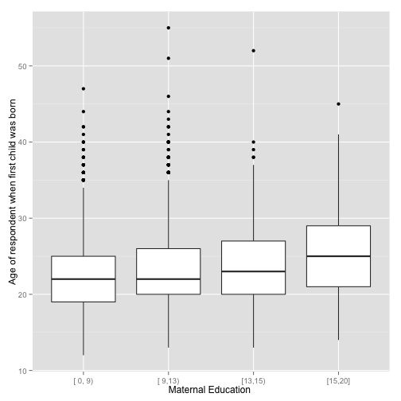
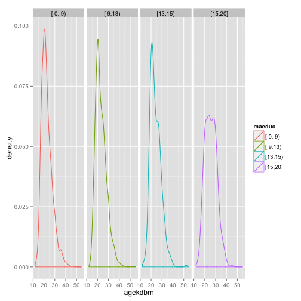

### Introduction:

The age at which individuals have their first child has important effects on the health of both the new mother and child, and the child's social and mental development, and economic standing. For example, after the age of 34, a woman is much more likely to have health issues that complicate pregnancy, as well as difficulty conceiving without the intervention of fertility services.[^1] Recent research from Indiana University and the Karolinska Institute found that children born to fathers over the age of 45 were three times as likely to have autism and 13 times as likely to have ADHD, and were also more likely to go on to develop substance abuse problems and get lower grades in school.[^2] However, not all impacts of having children later in life are negative. Against the negative effects listed above are balanced the facts that mature parents often provide a more emotionally stable and economically sound environment for their children, that mature parents report higher psychological satisfaction, and that having children later in life may actually prolong the life of the mother.[^3] 

While it must be emphasized that there is no "correct" age at which to have children, it is undeniable that the age of an individual when his or her first child is born have far-reaching effects both for the individual, and for his or her child. There are many possible reasons why people may delay having their first child, such as a lack of job security, or a desire to invest in the time to explore their own lives, or to prioritize education, or career and income security. Another possible influencer may be the the educational level of the individuals' parents, which has been shown to be an important predictor of behavioural outcomes.[^4] In this analysis, individuals' maternal educational level, and the age at which that individual had his or her first child are examined to determine whether or not there exists a relationship between the two.

The focus on maternal educational level is important because it is a relatively new phenomenon. As recently as forty years ago, the numbers of women enrolled in higher education was marginal; over the last forty years, however, there has been unprecedented growth in women's enrollment at institutions of higher education, and the number of female students in tertiary institutions has grown almost twice as fast as that of men since 1970.[^5] If there does exist a relationship between maternal educational level and the age at which someone has their first child, particularly if this age increases with maternal education, it is reasonable to expect that delaying having children will become normative, which may be of importance for educators and healthcare providers. 

[^1]: _More Women Delaying First Pregnancy_ (Consumer HealthDay)
http://consumer.healthday.com/pregnancy-information-29/pregnancy-news-543/more-women-delaying-first-pregnancy-687630.html
[^2]: D’Onofrio BM, Rickert ME, Frans E, et al.: _Paternal Age at Childbearing and Offspring Psychiatric and Academic Morbidity_. JAMA Psychiatry. 2014;71(4):432-438. doi:10.1001/jamapsychiatry.2013.4525.
[^3]: _Deciding When To Have A Child, If Ever: The Impacts Later In Life_ http://www.sciencedaily.com/releases/2007/05/070511080340.htm
[^4]: Davis-Kean PE: _The influence of parent education and family income on child achievement: the indirect role of parental expectations and the home environment._ J Fam Psychol. 2005 Jun; 19(2):294-304.
[^5]: _Women in Higher Education_ http://www.uis.unesco.org/Education/Pages/women-higher-education.aspx

### Data:

The data for this study are a modified version of the GSS. The General Social Survey is a large-scale survey that has monitored societal trends, behaviours, attitudes, and attributes in the United States since 1972. The modified version of  the GSS data for Data Analysis and Statistical Inference Course (Duke University) is identical to the original excepting the removal of missing values, and that it provides only a sample of the total number of indicators. 

These data were collected over the years 1972 to 2012. According to Appendix A of the GSS Codebook for Cumulative Data, the data were collected by survey conducted via a multi-stage random sample, which blocked for sex, age, and employment status, as well as race and income levels. There were three modes of data collection: computer assisted personal interviewing (CAPI), face-to-face interviews, and telephone interviews. The interviewer was obliged to meet a quota for each blocking level, and, to minimize the introduction of convenience sampling bias (by neglecting to survey those at work or school), they were instructed to conduct their surveys after 1500 hours on weekdays, or on weekends and holidays. Each observation was an individual adult, living in the area scoped by the surveyor. In data collected before 2006, these individuals were exclusively English speakers; subsequent years included Spanish-speaking individuals as well. 

The respondents were interviewed about their background and families, and provided responses on a Likert Scale for Personal, Societal, Economic and Workplace concerns, as well as on their opinions on controversial social issues. In total, each respondent in the modified data set replied to well over 100 questions. This study limits itself to the examination of only two of those variables, identified in the GSS codebook by "maeduc" and "agekdbrn", which respectively correspond to the number of years of education received by the respondent's mother (from 0 to 20), and the age at which the respondent had his or her first child. Both of these data are numerical, the latter being continuous, and the former discrete.  

The population of interest for this study is all English- and Spanish-speaking United States residents, who are over 18 and not institutionalized. The geographic coverage is the entire United States. This is a retrospective observational study, and because the samples are randomly selected from the population of interest, the results are generalizable to the population. The conclusions of this study cannot be used to establish causality, as this is only a sample-based study. Even though the data sampling methods were designed to minimize convenience sampling bias, they may still suffer from non-response and voluntary response biases.

### Exploratory data analysis:

The data were subsetted to only include responses from 2006 onward, the year from which Spanish-speaking residents were included in the survey, and for which the "childs" variable (which indicate the number of children of the respondent) was at least one. From this subset, a smaller dataset was extracted, including for each individual their maternal educational level and their age when their first child was born. 

```r
# load required packages
packages<-c("Hmisc", "dplyr", "reshape2", "ggplot2")
sapply(packages, require, character.only = TRUE)
```

```
##    Hmisc    dplyr reshape2  ggplot2 
##     TRUE     TRUE     TRUE     TRUE
```

```r
# load the gss data, unless this step has already been done
if(!exists("gss")){
        load(url("http://bit.ly/dasi_gss_data"))
}
# subset gss to only include data after 2006 and for which respondents have more than 0 children
gss2<-gss[gss$year>=2006 & gss$childs >1, ]
# select the variables of interest from the subsetted data set
gss_small<-select(gss2, maeduc, agekdbrn)
# remove missing values
gss_small<-na.omit(gss_small)
```

The maeduc variable was converted from a discrete numerical variable to a categorical variable to facilitate further analysis


```r
gss_small$maeduc<-cut2(gss_small$maeduc, c(9, 13, 15))
levels(gss_small$maeduc)
```

```
## [1] "[ 0, 9)" "[ 9,13)" "[13,15)" "[15,20]"
```

```r
g<-ggplot(gss_small, aes(factor(maeduc), agekdbrn)) 
g<-g + geom_boxplot()
g<-g + xlab("Maternal Education ") 
g<-g + ylab("Age of respondent when first child was born"); g
```

 

```r
gg<- ggplot(data = gss_small, aes(agekdbrn, colour = maeduc)) 
gg<-gg + geom_density() + facet_grid(.~maeduc); gg
```

 

In combination, the boxplots and the density plots indicate a slight positive relationship between maternal education, and the age at which the respondents' first child was born. As the widespread higher education of women is a relatively new phenomenon, we would expect that there would be fewer grandmothers with the highest educational level; this is reflected in the density plots, where it can be seen that the number of grandmothers who have the highest level of education are the least populous. The distributions of the density curves shows that for each category, the distributions are all slightly right-skewed, more-or-less unimodal with small variance, with the density plot for individuals with mothers educated beyond 15 years being the least so. The average age and variance at which individuals have their first child depending on their mothers' education is given by the table computed by

```r
gss_melted<-melt(gss_small, id.vars = "maeduc")
gss_means<-dcast(gss_melted, formula = gss_melted$maeduc~variable, fun.aggregate = mean)
gss_sd<-dcast(gss_melted, formula = gss_melted$maeduc~variable, fun.aggregate = sd)
gss_summary<-cbind(gss_means, gss_sd[,2])
colnames(gss_summary)<-c("maeduc", "mean", "sd"); gss_summary
```

```
##    maeduc  mean    sd
## 1 [ 0, 9) 22.69 4.981
## 2 [ 9,13) 23.26 5.104
## 3 [13,15) 24.06 4.916
## 4 [15,20] 25.64 5.338
```

### Inference:

The skeptical view of the above data is that the observed variation of the average age at which an individual has his or her first child is due to chance, and not dependent on the educational level of his or her mother. The alternative point of view is that the variations are not due to chance, but are influenced by the maternal educational level. These points of view are expressed as the following null and alternative hypotheses  

$H_0: \mu_i=\mu_j$, for all $i, j\in \{[ 0, 9), [ 9,13), [13,15), [15,20]\}$ 

$H_A: \exists\ i, j \ni \mu_i\neq \mu_j$ for $i, j \in \{[ 0, 9), [ 9,13), [13,15), [15,20]\}$

When comparing multiple means, it is appropriate to use the Analysis of Variance (anova) when there is within-group and between-group independence, approximate within-group normality, and roughly equal within-group variability. The first condition is satisfied by the data, because they are unpaired and randomly sampled; the second condition appears to be satisfied by the distributions of the data, and variations are approximately all equal to each other, satisfying the third condition. 

The anova model is fitted by the R function aov()


```r
res<-aov(formula = agekdbrn~maeduc, data = gss_small)
summary(res)
```

```
##               Df Sum Sq Mean Sq F value Pr(>F)    
## maeduc         3   3586    1195    46.3 <2e-16 ***
## Residuals   4476 115626      26                   
## ---
## Signif. codes:  0 '***' 0.001 '**' 0.01 '*' 0.05 '.' 0.1 ' ' 1
```

While the most important part of this summary is the p-value (Pr(>F)), it is worthwhile to interpret the other values of this output. The column Df lists the degrees of freedom for the groupings (maeduc) and the error terms (Residuals). The group degrees of freedom are
$$df_G=k-1$$ where $k$ is the number of groups. The total degrees of freedom $df_T$ are one less than the number of observations and the degrees of freedom of the error term are the difference between $df_T$ and $df_G$.  

Similarly, the column Sum Squared gives the variability within groups and for error terms. The deviation of the group mean from the overall mean, weighted by sample size is $$SSG=\sum_{i=1}^{k}n_i(\bar{y_i}-\bar{y})^2$$ where $n_i$ is the number of observations within each group, $\bar{y}$ is the grand mean residual variability, and $\bar{y_i}$ is the mean of the response variable for group $i$. The unexplained variability, SSE, is the difference between the total and group sum squared errors.   

The mean squared errors are the ratios of the sum squared errors for groups and residuals to the degrees of freedom of the groups and residuals, respectively. The ratio of the group mean squared error to the residual mean squared error provides the F-value, which at 46.3 is fairly large, and so, the p-value is small.   

The p-value is the probability of at least as large a ratio between the "between" and "within" group variability, if in fact, the means of all groups are equal; since the returned value is much smaller than a significance level of 0.05, this is strong evidence for rejecting the null hypothesis, and concluding that at least one pair of means is different from the others.  

To identify which pairs of means show this difference, a paired t-test is used on each pair of groups with a Bonferroni correction of the significance level. If $i$ and $j$ are indices of any two maeduc groups and $i\neq j$, the null and alternative hypotheses to be compared are   
$H_0: \mu_i=\mu_j$  
$H_A: \mu_i \neq \mu_j$  
The modified significance level is  
$$\alpha^*=\frac{\alpha}{K}$$ where $K=\frac{k(k-1)}{2}$, and $k$ is the number of groups. The modified standard error is 
$$SE=\sqrt{\frac{MSE}{n1}+\frac{MSE}{n_2}}$$ and the degrees of freedom chosen are $df_e$


```r
alpha<-0.05 # significance level
k<-4 # number of groups
K<-(k*(k-1))/2 #correction
alpha_correct<-alpha/K; alpha_correct
```

```
## [1] 0.008333
```

The Bonferroni-corrected pairwise t-tests are computed by the function pairwise.t.test()

```r
res2<-pairwise.t.test(x = gss_small$agekdbrn, 
                      g = gss_small$maeduc, 
                      p.adjust.method = "bonferroni",
                      alternative = "two.sided", 
                      paired = F)
res2$p.value
```

```
##           [ 0, 9)   [ 9,13)  [13,15)
## [ 9,13) 1.286e-02        NA       NA
## [13,15) 4.912e-06 1.022e-02       NA
## [15,20] 3.912e-28 3.359e-22 3.87e-06
```
The above table displays a table of p-values: the probabilities of obtaining an observed value equal to the mean of the categories of the columns or more extreme, given that the mean value of the rows are in fact the true means. For example, the probability of obtaining an observed value or higher than the value observed in the category $[0,9)$ given that the true mean is the mean of the category $[9, 13)$ is 0.0129. The determination of whether the p-values indicate a statistically significant difference is accomplished by comparing each element of this table to the modified significance level, $\alpha^*$.

```r
res2$p.value<alpha_correct
```

```
##         [ 0, 9) [ 9,13) [13,15)
## [ 9,13)   FALSE      NA      NA
## [13,15)    TRUE   FALSE      NA
## [15,20]    TRUE    TRUE    TRUE
```
The above table indicates that the difference in the means for the groups $[9, 13)$ and  $[0,9)$, and $[13, 15)$ and $[9, 13)$ are not significant, but the difference in the means for all other pairs are. Thus, for each of these latter cases, there is strong evidence to reject the null hypothesis, and conclude that between any two of these remaining groups, there is a statistically significant difference between the means of each pair.   

A summary of these mean differences and a 95% confidence interval for each is provided in the table below


```r
tukey<-TukeyHSD(res, "maeduc"); tukey
```

```
##   Tukey multiple comparisons of means
##     95% family-wise confidence level
## 
## Fit: aov(formula = agekdbrn ~ maeduc, data = gss_small)
## 
## $maeduc
##                   diff     lwr   upr  p adj
## [ 9,13)-[ 0, 9) 0.5631 0.09191 1.034 0.0115
## [13,15)-[ 0, 9) 1.3668 0.65542 2.078 0.0000
## [15,20]-[ 0, 9) 2.9494 2.27485 3.624 0.0000
## [13,15)-[ 9,13) 0.8037 0.14578 1.462 0.0092
## [15,20]-[ 9,13) 2.3863 1.76839 3.004 0.0000
## [15,20]-[13,15) 1.5826 0.76661 2.399 0.0000
```

In the second column of the above table, it can clearly be observed that the difference in the average age at which an individual has his or her first child increases with the level of the individual's maternal education. For example, the average difference between the age at which the first child is born to individuals whose mothers have received at most 13 years of schooling is 0.6 years more than individuals whose mothers have received at most 9 years of schooling. This average difference increases to 1.4 years for individuals with mothers who have received at most 15 years of education, compared to individuals whose mothers have received at most 9 years; and it increases to an almost 3 year difference between individuals whose mothers have had up to 20 years of education versus those whose mother have had no more than 9. A similar increase in the difference of the average age at which individuals have their first child can be observed between individuals with a maternal educational level of no more than 13 years and the levels above, and between individuals with a maternal educational level of no more than 15 years compared to the level above that. 

The statistically significant differences do not occur in adjacent groups of maternal education, with the exception of the last two pairings. 


### Conclusion:

The analysis demonstrates that there is a relationship between an individual's mother's level of education, and the age at which the individual has his or her first child. Specifically, as the maternal educational level of an individual increases, so too does the age at which that individual has his or her first child. 
It can be said with 95% confidence that 

* a randomly selected English- or Spanish-speaking United States resident whose mother's educational level is no more than 15 years has their first child between 0.65542 and 2.078 years later, on average, than residents whose maternal educational level is no more than 9 years. 
* a randomly selected English- or Spanish-speaking United States resident whose mother's educational level is no more than 20 years has their first child between between 2.27485 and 3.624 years later, on average, than residents whose maternal educational level is no more than 9 years. 
* a randomly selected English- or Spanish-speaking United States resident whose mother's educational level is no more than 20 years has their first child between between 1.76839 and 3.004 years later, on average, than residents whose maternal educational level is no more than 13 years. 
* a randomly selected English- or Spanish-speaking United States resident whose mother's educational level is no more than 20 years has their first child between between 0.76661 and 2.399 years later, on average, than residents whose maternal educational level is no more than 15 years. 

All other differences were found to be statistically insignificant.   

One possible criticism of this study is that for United States residents whose primary language is Spanish, it is reasonable to assume recent immigration, of up to within a couple of generations above the respondent. The GSS data do not indicate if the maternal educational level is trans-border, or exclusively American education. If it is the latter, then an individual whose mother migrated to the United States at the age of 15 would undoubtedly have a lower maternal education level score than an individual whose mother migrated to the United States at the age of 5, regardless of whether the former individual's mother had been given continuous access to education prior to migration, and this could distort the results. 

The GSS data do not contain information on the recency of immigration to the United States, but does indicate whether one or both or neither of the respondent's parents were born in the United States. The results of this study would be strengthened if an analysis for respondents whose mothers were born in the United States gave similar conclusions. Against this could be contrasted an analysis for respondents whose mothers were not born in the United States; this comparison could from the basis of future work. 


### Works Cited

Smith, Tom W., Michael Hout, and Peter V. Marsden. General Social Survey, 1972-2012 Cumulative File, 1972-2012 Coursera Extract. ICPSR34802-v1. Storrs, CT: Roper Center for Public Opinion Research, University of Connecticut /Ann Arbor, MI: Inter-university Consortium for Political and Social Research [distributors], 2013-09-11. doi:10.3886/ICPSR34802.v1

<http://www.icpsr.umich.edu/icpsrweb/ICPSR/studies/34802/version/1>

### Appendix
Data used (sample)

```
##        maeduc agekdbrn
## 46511 [15,20]       28
## 46516 [ 9,13)       28
## 46520 [13,15)       19
## 46521 [ 0, 9)       20
## 46522 [ 9,13)       33
## 46525 [ 9,13)       20
## 46527 [ 0, 9)       20
## 46537 [ 9,13)       16
## 46545 [ 9,13)       23
## 46553 [15,20]       22
## 46563 [ 9,13)       22
## 46566 [ 9,13)       24
## 46568 [13,15)       21
## 46572 [ 0, 9)       38
## 46575 [ 9,13)       22
## 46577 [ 9,13)       26
## 46578 [ 9,13)       18
## 46579 [ 0, 9)       30
## 46581 [ 0, 9)       32
## 46584 [ 9,13)       30
## 46587 [ 9,13)       31
## 46591 [15,20]       25
## 46594 [ 9,13)       30
## 46598 [ 0, 9)       23
## 46601 [ 0, 9)       20
```
